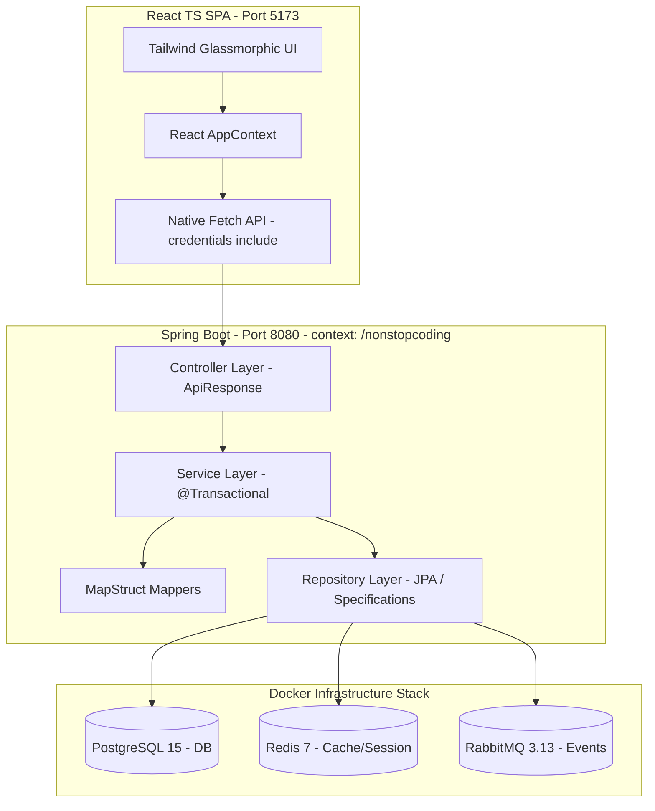

# 🚀 NONSTOPCODING - VIBE_CODE (AI & Developer Guidelines)

Welcome to the development handbook for **Nonstop Coding**! 

This project follows strict industry-grade architectures, focusing on performance, security, and long-term maintainability. Before generating code or starting a feature, **review these guidelines** to ensure your code aligns 100% with our project patterns and standards. Avoid N+1 queries, redundant code, or bypassing security guards.

---

## 🛠 1. Tech Stack & Architecture Overview

Our system is structured as a modern, decoupled React SPA and Spring Boot backend:



---

## 📐 2. Backend Coding Conventions (Java & Spring Boot)

### 2.1. Strict 3-Layer Architecture
1. **Controller Layer:** Only handles incoming HTTP Requests, applies basic validation (`@Valid`), delegates parameters, calls Services, and returns `ResponseEntity<ApiResponse<T>>`.
   * **PROHIBITED:** Never write business logic, perform calculations, or call repositories directly here.
2. **Service Layer:** The core of the system. Contains all business logic, calculations, calls Mappers to translate between DTOs and Entities, and coordinates multiple repositories.
3. **Repository Layer:** Exclusively handles database interaction via Spring Data JPA or custom Specifications.

### 2.2. Dependency Injection Without `@Autowired`
* **PROHIBITED:** Never use field injection (`@Autowired` on variables). It makes unit testing difficult and breaks encapsulation.
* **MANDATORY:** Use **Constructor Injection** combined with Lombok annotations:

> [!NOTE]
> Apply `@FieldDefaults(level = AccessLevel.PRIVATE, makeFinal = true)` to make all fields `private final`, ensuring immutability and thread safety.

```java
@Service
@RequiredArgsConstructor
@FieldDefaults(level = AccessLevel.PRIVATE, makeFinal = true)
public class CourseService {
    CourseRepository courseRepository;
    CourseMapper courseMapper;
    EnrollmentRepository enrollmentRepository;
}
```

### 2.3. Data Mapping via MapStruct
* Avoid manual getters and setters for large objects. Always use MapStruct Mappers configured with `@Mapper(componentModel = "spring")`.
* Use mapping expressions or custom methods for nested or dynamic relationships.

*Example MapStruct Mapper configuration:*
```java
@Mapper(componentModel = "spring")
public interface CourseMapper {
    @Mapping(target = "enrolled", ignore = true)
    @Mapping(target = "progressPercentage", ignore = true)
    @Mapping(target = "instructorName", source = "instructor.fullName")
    @Mapping(target = "categoryName", expression = "java(courseEntity.getCategories() != null && !courseEntity.getCategories().isEmpty() ? courseEntity.getCategories().iterator().next().getName() : null)")
    CourseListItemResponse toCourseListItemResponse(CourseEntity courseEntity);
}
```

### 2.4. Transaction Management
* Any modifying methods in a Service (CREATE, UPDATE, DELETE) **must** be annotated with `@Transactional`.
* Read-only methods **must** be annotated with `@Transactional(readOnly = true)` to let Hibernate optimize Session cache and bypass dirty checks, speeding up reads.

---

## ⚡ 3. Database & Query Optimization (SQL & JPA)

> [!WARNING]
> Bad query design will result in direct rejection. AI and developers must follow these optimization rules:

### 3.1. Prevent N+1 Queries
When retrieving an entity along with its lazy relations, never trigger Lazy Loading inside a loop.
* **Solution 1:** Use `@EntityGraph` on repository methods to fetch relationships in a single query:
  ```java
  @EntityGraph(attributePaths = {"categories", "instructor"})
  Optional<CourseEntity> findById(Long id);
  ```
* **Solution 2:** Write custom JPQL Queries using `JOIN FETCH`:
  ```java
  @Query("SELECT c FROM CourseEntity c LEFT JOIN FETCH c.categories WHERE c.id = :id")
  Optional<CourseEntity> findCourseWithCategories(@Param("id") Long id);
  ```

### 3.2. Prevent Cartesian Products in Specification Joins
When performing dynamic filtering using Criteria joins, always call `query.distinct(true)` on the `CriteriaQuery` object to avoid duplicate result rows:
```java
public static Specification<CourseEntity> hasCategories(List<Long> categoryIds) {
    return (root, query, cb) -> {
        if (categoryIds == null || categoryIds.isEmpty()) return null;
        Join<CourseEntity, CategoryEntity> categoryJoin = root.join("categories", JoinType.INNER);
        if (query != null) {    
            query.distinct(true); // CRITICAL: prevents duplicate data rows
        }
        return categoryJoin.get("id").in(categoryIds);
    };
}
```

### 3.3. Spring Boot Standard Pagination DTO
All paginated API responses must strictly map to the standard Spring `PageResponse<T>` wrapper structure:
```java
public class PageResponse<T> {
    int page;
    int size;
    long numberOfElements;
    long totalElements;
    int totalPages;
    boolean first;
    boolean last;
    List<T> content; // The array containing paginated records must be named "content"
}
```

---

## 🔐 4. Authentication & Security Flow (Backend & Frontend)

To defend against XSS and CSRF attacks, Nonstop Coding uses a secure cookie-based token delivery mechanism:

```
+------------------+                    +--------------------+
|  React Frontend  |                    |  Spring Boot API   |
+------------------+                    +--------------------+
         |                                         |
         |----- POST /auth/login ----------------->|
         |<---- HTTP Status 200 -------------------|
         |      (Set-Cookie: access_token)         | (HttpOnly, Secure, SameSite=Lax)
         |      (Set-Cookie: refresh_token)        |
         |                                         |
         |----- GET /courses (No token in body) -->| (Browser auto-attaches cookies)
         |<---- Course list successfully ----------| (credentials: 'include')
         |                                         |
```

### 4.1. HttpOnly Cookies Transport
* **Backend:** Secret tokens (Access/Refresh Token) are **NEVER** returned in the JSON response body. They are attached directly to the `Set-Cookie` header as **HttpOnly, Secure, and SameSite=Lax** cookies.
* **Frontend:** Avoid storing tokens in `localStorage` or `sessionStorage`. Browser handles cookies automatically for every HTTP request.
* **MANDATORY for Frontend:** Every fetch/axios call to protected backend APIs must set **`credentials: 'include'`** (or `withCredentials: true` in Axios):

*Example API fetch request in frontend:*
```typescript
export const fetchCourses = async (params: CourseSearchRequestParams): Promise<PageResponse<CourseListItemResponse>> => {
  const queryParams = new URLSearchParams();
  // ... parameters building ...

  const response = await fetch(`${BASE_URL}/courses?${queryParams.toString()}`, {
    method: 'GET',
    headers: {
      'Content-Type': 'application/json',
    },
    credentials: 'include', // MANDATORY: attaches secure cookies for session authentication
  });

  const data: ApiResponse<PageResponse<CourseListItemResponse>> = await response.json();
  return data.result;
};
```

---

## 💻 5. Frontend Coding Conventions (React, TypeScript & Tailwind)

### 5.1. Route Protection & Auth Guards
Pages containing private user info or requiring logged-in sessions (e.g. `dashboard`, `wallet-transaction`, `shopping-cart`) must be wrapped with redirection guards inside the layout shell to redirect guest users back to Home:
```typescript
const privateRoutes = ['/dashboard', '/instructor', '/wallet-transaction', '/payment-transaction', '/shopping-cart'];
const isPrivateRoute = privateRoutes.some(route => location.pathname.startsWith(route));

React.useEffect(() => {
  if (!user && isPrivateRoute) {
    navigate('/', { replace: true });
  }
}, [user, isPrivateRoute, navigate]);
```

### 5.2. Dynamic Header Layout
* For optimal security and premium UX, when a user is not logged in, the header hides the `My Learning` tab and replaces the avatar dropdown with a styled **Login** button.
* Clicking the Login button routes to `/login`. Upon successful login, the app redirects the user to `/dashboard` (My Learning).

### 5.3. 3-Column Grid Layout
* Course grids are configured strictly to display **3 cards per row** (`lg:grid-cols-3` instead of 4) on large screens, leaving ample room for reading the `shortDescription` and displaying learning `progressPercentage` lines.

---

## 🤖 6. Vibe Coding Guidelines For AI Assistants

When pair programming with developers on this codebase, AI assistants should apply these guidelines:

1. **Observe Existing Architectures:** Read `pom.xml`, configurations like `application-dev.yaml`, and global helpers like `GlobalExceptionHandler.java` before proposing new classes.
2. **Always Use DTOs:** Never output database `Entity` objects containing circular relations directly through controllers. Always map to a response DTO first.
3. **Database Snake_case vs Java CamelCase:**
   * Java Entity properties: `averageRating`, `totalReviews`, `totalEnrolled`.
   * Postgres column names: `average_rating`, `total_reviews`, `total_enrolled`.
4. **Use Conventional Commits:** Prefix commits clearly (`feat(scope): ...`, `fix(scope): ...`).
5. **Preserve Visual Aesthetics:** Keep the premium glassmorphism effects, smooth box-shadow changes (`transition-all hover:-translate-y-1 hover:shadow-lg`), and rounded elements (`rounded-xl` or `rounded-2xl`).

---

*Continuous learning, spotless code. Let's make Nonstop Coding state-of-the-art! 🚀*
