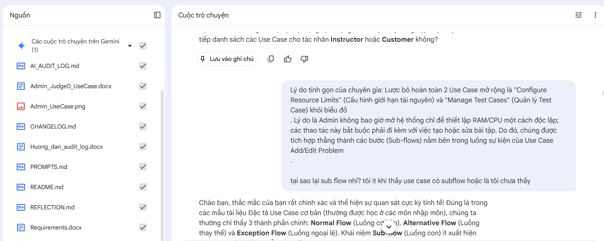

# AI Audit Log

## 1. Thông tin chung

| Thông tin | Nội dung                                                         |
|---|------------------------------------------------------------------|
| Môn học | Software development project                                     |
| Mã môn học | SWP391                                                           |
| Lớp | SE20A11                                                          |
| Học kỳ | Summer 2026                                                      |
| Tên bài tập / Project | Integrated Coding Education and Competitive Programming Platform |
| Tên sinh viên / Nhóm | Nguyễn Duy Phương  - Group 2                                     |
| MSSV / Danh sách MSSV | DE190416                                                         |
| Giảng viên hướng dẫn | Lê Thiện Nhật Quang                                              |
| Ngày bắt đầu | 11/05/2026                                                       |
| Ngày hoàn thành | 30/07/2026                                                       |

---

## 2. Công cụ AI đã sử dụng

Đánh dấu các công cụ AI đã sử dụng trong quá trình thực hiện bài tập/project.

- [x] ChatGPT
- [x] Gemini
- [ ] Claude
- [x] GitHub Copilot
- [x] Cursor
- [ ] Antigravity
- [ ] Perplexity
- [ ] Microsoft Copilot
- [x] Công cụ khác: NotebookLM

---

## 3. Mục tiêu sử dụng AI

Mô tả ngắn gọn sinh viên/nhóm đã sử dụng AI để hỗ trợ những công việc nào.

Ví dụ:

- Phân tích yêu cầu bài toán
- Gợi ý ý tưởng giải pháp
- Thiết kế database
- Thiết kế giao diện
- Viết code mẫu
- Debug lỗi
- Tối ưu code
- Viết test case
- Kiểm tra bảo mật
- Viết báo cáo
- Chuẩn bị slide thuyết trình
- Tìm hiểu công nghệ mới

### Mô tả mục tiêu sử dụng AI

```text
- Phân tích yêu cầu bài toán thực tế cho dự án SWP391
- Tìm hiểu công nghệ spring boot
- Phân tích yêu cầu và hỗ trợ lập tài liệu kỹ thuật hệ thống (Software Requirements Specification - SRS).
- Tìm hiểu lý thuyết UML để chuẩn hóa sơ đồ Use Case cho các tác nhân (Actor) trong hệ thống.
- Thiết lập quy trình quản lý mã nguồn (Git Flow) cho nhóm 5 thành viên trên GitHub nhằm tối ưu hóa làm việc nhóm và giảm thiểu merge conflict.

```

## 4. Nhật ký sử dụng AI chi tiết

> Mỗi lần sử dụng AI cho một phần quan trọng của bài tập/project, sinh viên cần ghi lại theo mẫu bên dưới.  
> Sinh viên/nhóm có thể nhân bản mẫu “Lần sử dụng AI” nhiều lần tùy theo số lần sử dụng AI thực tế.

---

### Lần sử dụng AI số 1

| Nội dung | Thông tin                                                             |
|---|-----------------------------------------------------------------------|
| Ngày sử dụng | 19/05/2026                                                            |
| Công cụ AI | NotebookLM                                                            |
| Mục đích sử dụng | Tái cấu trúc Use Case phân hệ Admin                                   |
| Phần việc liên quan | Requirement, Report                                                   |
| Mức độ sử dụng |  Hỗ trợ nhiều  |

#### 4.1. Prompt đã sử dụng

```text
    xem file admin and judge use case tôi mới gửi xem nội dung có ổn chưa? Những cái trigger ví dụ như "Admin quyết định phê duyệt khóa học sau khi kiểm tra nội dung đạt tiêu chuẩn chất lượng của sàn" có phải đúng chuẩn trigger. 
Bên cạnh đó, những use case manage contest hoặc manage transactional trong main flow như vậy có đúng thực tế chưa?? Và tại sao bên trong alternative flow lại có các use case khác extend / include từ nó vậy?
 - Có nên gộp những use case như Reject Contest, Approve Contest, View Contest Statistics và thành 1 trong manage contest hay không? Nếu có thì đề xuất những cái use case cần tinh gọn.
 - Có nên Gộp lock và unlock user vào 1 use case không và có nên gộp Approve và reject vào 1 hay không?
```

#### 4.2. Kết quả AI gợi ý

Tóm tắt nội dung AI đã trả lời hoặc gợi ý.

```text
  AI xác nhận Trigger viết sai (chứa yếu tố tâm lý), hướng dẫn sửa thành hành động vật lý (nhấn nút).
Đồng thời, AI đề xuất gộp triệt để các Use Case nhỏ lẻ (Approve, Reject, View Stats) vào một Use Case
quản lý chung (Manage Contest/Course) để khắc phục lỗi "Use Case Bloat" (Phình to tài liệu).
```

#### 4.3. Phần sinh viên/nhóm đã sử dụng từ AI

Mô tả rõ phần nào được sử dụng lại từ gợi ý của AI.

```text
   Kết hợp đề xuất của AI để vạch ra chiến lược "đại phẫu" toàn bộ 25 Use Case của Admin, chuyển đổi 
các chức năng mở rộng (Extend/Include) vào bên trong một Use Case gốc.
```

#### 4.4. Phần sinh viên/nhóm tự chỉnh sửa hoặc cải tiến

Mô tả sinh viên/nhóm đã thay đổi, kiểm tra, sửa lỗi hoặc cải tiến gì so với gợi ý ban đầu của AI.

```text
   Gộp các Use Case lẻ (Approve, Reject, Lock, Unlock) vào Use Case Manage tương ứng, chủ động giảm số 
lượng Use Case của Admin từ 25 xuống còn 7, tối ưu hóa sự mạch lạc của tài liệu SRS chuẩn UML.
```

#### 4.5. Minh chứng

| Loại minh chứng | Nội dung                                      |
|---|-----------------------------------------------|
| Link commit |                                               |
| File liên quan |                                               |
| Screenshot |  |
| Kết quả chạy/test |                                               |
| Link video demo |                                               |
| Ghi chú khác |  Core Prompt: Problem-Solving.                                             |

#### 4.6. Nhận xét cá nhân/nhóm

Sinh viên/nhóm học được gì sau lần sử dụng AI này?

```text
(Critical Thinking): AI đánh giá chuẩn xác. Nhờ đó, tôi nhận ra lỗi cơ bản trong tư duy thiết kế hệ thống khi nhầm lẫn giữa một "tính năng/giá trị nghiệp vụ" và một "nút bấm trên UI". 
(Contextualization): Bối cảnh dự án SWP391 yêu cầu tài liệu SRS phải chuẩn UML. Admin vào trang quản lý để thực hiện một chuỗi quy trình kiểm duyệt, không phải mở hệ thống lên chỉ để bấm một nút "Approve" rồi thoát.
```

---

### Lần sử dụng AI số 2

| Nội dung | Thông tin |
|---|---|
| Ngày sử dụng |  |
| Công cụ AI | ChatGPT / Gemini / Claude / GitHub Copilot / Cursor / Antigravity / Khác |
| Mục đích sử dụng |  |
| Phần việc liên quan | Requirement / Design / Database / Frontend / Backend / Testing / Debug / Report / Presentation / Other |
| Mức độ sử dụng | Hỗ trợ ý tưởng / Hỗ trợ một phần / Hỗ trợ nhiều / Sinh chính nội dung |

#### 4.1. Prompt đã sử dụng

```text
Dán nguyên văn prompt đã hỏi AI tại đây.
```

#### 4.2. Kết quả AI gợi ý

```text
Viết tại đây...
```

#### 4.3. Phần sinh viên/nhóm đã sử dụng từ AI

```text
Viết tại đây...
```

#### 4.4. Phần sinh viên/nhóm tự chỉnh sửa hoặc cải tiến

```text
Viết tại đây...
```

#### 4.5. Minh chứng

| Loại minh chứng | Nội dung |
|---|---|
| Link commit |  |
| File liên quan |  |
| Screenshot |  |
| Kết quả chạy/test |  |
| Link video demo |  |
| Ghi chú khác |  |

#### 4.6. Nhận xét cá nhân/nhóm

```text
Viết tại đây...
```

---

### Lần sử dụng AI số 3

| Nội dung | Thông tin |
|---|---|
| Ngày sử dụng |  |
| Công cụ AI | ChatGPT / Gemini / Claude / GitHub Copilot / Cursor / Antigravity / Khác |
| Mục đích sử dụng |  |
| Phần việc liên quan | Requirement / Design / Database / Frontend / Backend / Testing / Debug / Report / Presentation / Other |
| Mức độ sử dụng | Hỗ trợ ý tưởng / Hỗ trợ một phần / Hỗ trợ nhiều / Sinh chính nội dung |

#### 4.1. Prompt đã sử dụng

```text
Dán nguyên văn prompt đã hỏi AI tại đây.
```

#### 4.2. Kết quả AI gợi ý

```text
Viết tại đây...
```

#### 4.3. Phần sinh viên/nhóm đã sử dụng từ AI

```text
Viết tại đây...
```

#### 4.4. Phần sinh viên/nhóm tự chỉnh sửa hoặc cải tiến

```text
Viết tại đây...
```

#### 4.5. Minh chứng

| Loại minh chứng | Nội dung |
|---|---|
| Link commit |  |
| File liên quan |  |
| Screenshot |  |
| Kết quả chạy/test |  |
| Link video demo |  |
| Ghi chú khác |  |

#### 4.6. Nhận xét cá nhân/nhóm

```text
Viết tại đây...
```

---

## 5. Bảng tổng hợp mức độ sử dụng AI

Đánh dấu mức độ AI hỗ trợ ở từng hạng mục.

| Hạng mục | Không dùng AI | AI hỗ trợ ít | AI hỗ trợ nhiều | AI sinh chính | Ghi chú |
|---|:---:|:------------:|:---------------:|:-------------:|---|
| Phân tích yêu cầu |  |              |        x        |               |  |
| Viết user story/use case |  |      x       |                 |               |  |
| Thiết kế database |  |              |                 |               |  |
| Thiết kế kiến trúc hệ thống |  |      x       |                 |               |  |
| Thiết kế giao diện |  |              |                 |       x       |  |
| Code frontend |  |              |                 |               |  |
| Code backend |  |              |                 |               |  |
| Debug lỗi |  |              |                 |               |  |
| Viết test case |  |              |                 |               |  |
| Kiểm thử sản phẩm |  |              |                 |               |  |
| Tối ưu code |  |              |                 |               |  |
| Viết báo cáo |  |              |        x        |               |  |
| Làm slide thuyết trình |  |              |        x        |               |  |

---

## 6. Các lỗi hoặc hạn chế từ AI

Ghi lại các trường hợp AI trả lời sai, thiếu, chưa phù hợp hoặc sinh code không chạy.

| STT | Lỗi/hạn chế từ AI | Cách phát hiện                        | Cách xử lý/cải tiến                       |
|---:|---|---------------------------------------|-------------------------------------------|
| 1 | Logic Error / Oversimplification: AI đánh đồng hành động "Compile Code" (Biên dịch) và "Compile Error" (Lỗi biên dịch), gộp chung vào Exception Flow của Judge0. | Review lại output của AI và phát hiện | Ép AI nhận diện lại use case Compile Code |
| 2 |  |                                       |                                           |
| 3 |  |                                       |                                           |

---

## 7. Kiểm chứng kết quả AI

Mô tả cách sinh viên/nhóm kiểm tra lại kết quả do AI gợi ý.

Có thể bao gồm:

- Chạy thử chương trình
- Viết test case
- So sánh với yêu cầu đề bài
- Kiểm tra output
- Đối chiếu tài liệu môn học
- Hỏi lại giảng viên
- Review cùng thành viên nhóm
- Kiểm tra lỗi bảo mật
- Kiểm tra bằng dữ liệu mẫu
- So sánh trước và sau khi dùng AI

### Nội dung kiểm chứng

```text
- Hỏi lại giảng viên.
- Review cùng thành viên nhóm.
- So sánh trước và sau khi dùng AI.
- Trực tiếp rà soát chéo (cross-check) định nghĩa của AI với tài liệu UML Specification gốc và Official Documentation của Judge0 để xác thực luồng biên dịch.
- Đặt giả thuyết phản biện (Ví dụ: "Nếu Sub-flow là bắt buộc thì...") để test logic của AI.
```

---

## 8. Đóng góp cá nhân hoặc đóng góp nhóm

### 8.1. Đối với bài cá nhân

Mô tả phần sinh viên tự làm, phần AI hỗ trợ và phần đã tự cải tiến.

```text
- Phần tự làm: Tự nghiên cứu quy trình nghiệp vụ Judge0, luồng UI/UX Admin. Tự tay cấu trúc hệ thống luồng Alternative/Exception, vẽ Diagram và ra quyết định loại bỏ các tác vụ thừa.
- Phần AI hỗ trợ: "Đại phẫu" gom nhóm 25 Use Case phân mảnh thành 7 Use Case cốt lõi, sinh format bảng đặc tả.
- Phần tự cải tiến: Phát hiện và bác bỏ 2 lỗi logic nghiêm trọng của AI (sai khái niệm Compile và nhầm lẫn Sub-flow/Alternative Flow).
```

### 8.2. Đối với bài nhóm

| Thành viên | MSSV | Nhiệm vụ chính | Có sử dụng AI không? | Minh chứng đóng góp |
|---|---|---|---|---|
|  |  |  | Có / Không |  |
|  |  |  | Có / Không |  |
|  |  |  | Có / Không |  |
|  |  |  | Có / Không |  |

---

## 9. Reflection cuối bài

### 9.1. AI đã hỗ trợ em/nhóm ở điểm nào?

```text
- Xử lý văn bản xuất sắc, giúp "đại phẫu" bộ tài liệu bằng cách gom nhóm 25 Use Case rải rác xuống còn 7 Use Case quản lý cốt lõi, khắc phục tình trạng Use Case Bloat.
- Hỗ trợ em đưa ra các giả thuyết thiết kế và đánh giá tính khả thi (ví dụ: việc xóa Use Case thừa khỏi bản vẽ).
```

### 9.2. Phần nào em/nhóm không sử dụng theo gợi ý của AI? Vì sao?

```text
Không sử dụng cấu trúc phân luồng Sub-flow và Exception Flow ban đầu do AI thiết kế. Vì AI tư duy máy móc, thiếu bối cảnh thực tế (Context), gán các thao tác tùy chọn (Approve/Reject) vào luồng bắt buộc, và nhầm lẫn giữa tính năng (Compile Code) với lỗi (Compile Error).
```

### 9.3. Em/nhóm đã kiểm tra tính đúng đắn của kết quả AI như thế nào?

```text
Sử dụng Critical Thinking để đối chiếu kết quả của AI với tài liệu thiết kế gốc, tài liệu kỹ thuật Judge0 và trải nghiệm UX thực tế. Liên tục đặt các prompt truy vấn ngược (Verification Prompts) để ép AI lộ ra lỗ hổng logic.
```

### 9.4. Nếu không có AI, phần nào sẽ khó khăn nhất?

```text
Việc tìm ra chiến lược rà soát, tinh gọn và tái cấu trúc (Decomposition) toàn bộ 25 Use Case phân mảnh thành một hệ thống mạch lạc, nhất quán và dọn dẹp hiện tượng "mạng nhện thị giác" (Visual Clutter) trên Use Case Diagram.
```

### 9.5. Sau bài tập/project này, em/nhóm học được gì về môn học?

```text
Hiểu sâu sắc ranh giới học thuật trong UML: Main Flow, Sub-flow, Alternative Flow và Exception Flow. Nắm vững nguyên tắc "1 hình Ellipse = 1 Bảng đặc tả" và cách tư duy thiết kế hệ thống.
```

### 9.6. Sau bài tập/project này, em/nhóm học được gì về cách sử dụng AI có trách nhiệm?

```text
AI dễ mắc lỗi "Oversimplification" (đơn giản hóa quá mức) khi xử lý logic chuyên sâu. Sử dụng AI có trách nhiệm nghĩa là người dùng (Dev/BA) phải có Domain Knowledge vững vàng để làm chủ quyết định cuối cùng (Decision Ownership), không phó mặc việc thiết kế hệ thống cho AI.
```

---

## 10. Cam kết học thuật

Sinh viên/nhóm cam kết rằng:

- Nội dung AI hỗ trợ đã được ghi nhận trung thực.
- Không nộp nguyên văn kết quả AI mà không kiểm tra.
- Có khả năng giải thích các phần đã nộp.
- Chịu trách nhiệm về tính đúng đắn của sản phẩm cuối cùng.
- Hiểu rằng việc sử dụng AI không khai báo có thể ảnh hưởng đến kết quả đánh giá.

| Đại diện sinh viên/nhóm | Ngày xác nhận |
|---|---|
|  |  |
