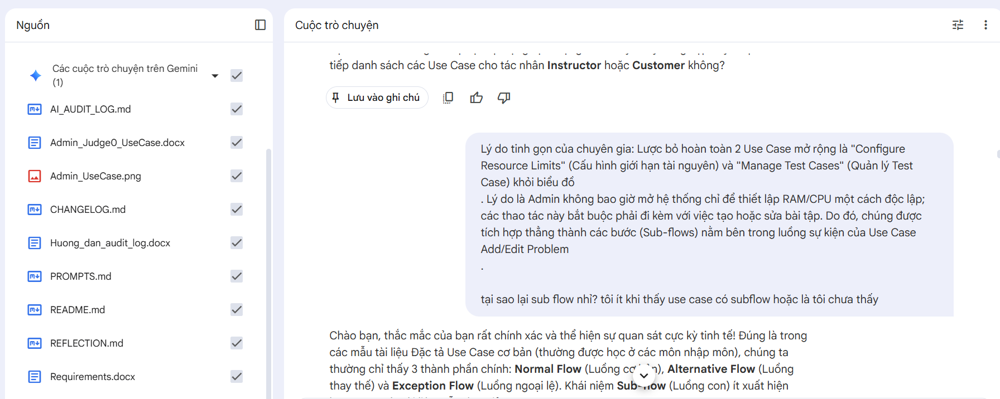

# AI Audit Log

## 1. Thông tin chung

| Thông tin | Nội dung                                                         |
|---|------------------------------------------------------------------|
| Môn học | Software development project                                     |
| Mã môn học | SWP391                                                           |
| Lớp | SE20A11                                                          |
| Học kỳ | Summer 2026                                                      |
| Tên bài tập / Project | Integrated Coding Education and Competitive Programming Platform |
| Tên sinh viên / Nhóm | Nguyễn Duy Phương  - Group 2                                     |
| MSSV / Danh sách MSSV | DE190416                                                         |
| Giảng viên hướng dẫn | Lê Thiện Nhật Quang                                              |
| Ngày bắt đầu | 11/05/2026                                                       |
| Ngày hoàn thành | 30/07/2026                                                       |

---

## 2. Công cụ AI đã sử dụng

Đánh dấu các công cụ AI đã sử dụng trong quá trình thực hiện bài tập/project.

- [x] ChatGPT
- [x] Gemini
- [ ] Claude
- [x] GitHub Copilot
- [x] Cursor
- [x] Antigravity
- [ ] Perplexity
- [ ] Microsoft Copilot
- [x] Công cụ khác: NotebookLM

---

## 3. Mục tiêu sử dụng AI

Mô tả ngắn gọn sinh viên/nhóm đã sử dụng AI để hỗ trợ những công việc nào.

Ví dụ:

- Phân tích yêu cầu bài toán
- Gợi ý ý tưởng giải pháp
- Thiết kế database
- Thiết kế giao diện
- Viết code mẫu
- Debug lỗi
- Tối ưu code
- Viết test case
- Kiểm tra bảo mật
- Viết báo cáo
- Chuẩn bị slide thuyết trình
- Tìm hiểu công nghệ mới

### Mô tả mục tiêu sử dụng AI

```text
- Phân tích yêu cầu bài toán thực tế cho dự án SWP391
- Tìm hiểu công nghệ spring boot
- Phân tích yêu cầu và hỗ trợ lập tài liệu kỹ thuật hệ thống (Software Requirements Specification - SRS).
- Tìm hiểu lý thuyết UML để chuẩn hóa sơ đồ Use Case cho các tác nhân (Actor) trong hệ thống.
- Thiết lập quy trình quản lý mã nguồn (Git Flow) cho nhóm 5 thành viên trên GitHub nhằm tối ưu hóa làm việc nhóm và giảm thiểu merge conflict.
- Khắc phục lỗi ẩn nút Admin Panel trên giao diện điều hướng (Layout.tsx) cho tài khoản admin.
- Thiết kế tệp SQL seed dữ liệu kiểm thử (contest_seed.sql) và đồng bộ sequence PostgreSQL.
- Refactor hệ thống định tuyến (Nested Routes) cho Admin Dashboard sử dụng React Router động.
```

## 4. Nhật ký sử dụng AI chi tiết

> Mỗi lần sử dụng AI cho một phần quan trọng của bài tập/project, sinh viên cần ghi lại theo mẫu bên dưới.  
> Sinh viên/nhóm có thể nhân bản mẫu “Lần sử dụng AI” nhiều lần tùy theo số lần sử dụng AI thực tế.

---

### Lần sử dụng AI số 1

| Nội dung | Thông tin                                                             |
|---|-----------------------------------------------------------------------|
| Ngày sử dụng | 19/05/2026                                                            |
| Công cụ AI | NotebookLM                                                            |
| Mục đích sử dụng | Tái cấu trúc Use Case phân hệ Admin                                   |
| Phần việc liên quan | Requirement, Report                                                   |
| Mức độ sử dụng |  Hỗ trợ nhiều  |

#### 4.1. Prompt đã sử dụng

```text
    xem file admin and judge use case tôi mới gửi xem nội dung có ổn chưa? Những cái trigger ví dụ như "Admin quyết định phê duyệt khóa học sau khi kiểm tra nội dung đạt tiêu chuẩn chất lượng của sàn" có phải đúng chuẩn trigger. 
Bên cạnh đó, những use case manage contest hoặc manage transactional trong main flow như vậy có đúng thực tế chưa?? Và tại sao bên trong alternative flow lại có các use case khác extend / include từ nó vậy?
 - Có nên gộp những use case như Reject Contest, Approve Contest, View Contest Statistics và thành 1 trong manage contest hay không? Nếu có thì đề xuất những cái use case cần tinh gọn.
 - Có nên Gộp lock và unlock user vào 1 use case không và có nên gộp Approve và reject vào 1 hay không?
```

#### 4.2. Kết quả AI gợi ý

Tóm tắt nội dung AI đã trả lời hoặc gợi ý.

```text
  AI xác nhận Trigger viết sai (chứa yếu tố tâm lý), hướng dẫn sửa thành hành động vật lý (nhấn nút).
Đồng thời, AI đề xuất gộp triệt để các Use Case nhỏ lẻ (Approve, Reject, View Stats) vào một Use Case
quản lý chung (Manage Contest/Course) để khắc phục lỗi "Use Case Bloat" (Phình to tài liệu).
```

#### 4.3. Phần sinh viên/nhóm đã sử dụng từ AI

Mô tả rõ phần nào được sử dụng lại từ gợi ý của AI.

```text
   Kết hợp đề xuất của AI để vạch ra chiến lược "đại phẫu" toàn bộ 25 Use Case của Admin, chuyển đổi 
các chức năng mở rộng (Extend/Include) vào bên trong một Use Case gốc.
```

#### 4.4. Phần sinh viên/nhóm tự chỉnh sửa hoặc cải tiến

Mô tả sinh viên/nhóm đã thay đổi, kiểm tra, sửa lỗi hoặc cải tiến gì so với gợi ý ban đầu của AI.

```text
   Gộp các Use Case lẻ (Approve, Reject, Lock, Unlock) vào Use Case Manage tương ứng, chủ động giảm số 
lượng Use Case của Admin từ 25 xuống còn 7, tối ưu hóa sự mạch lạc của tài liệu SRS chuẩn UML.
```

#### 4.5. Minh chứng

| Loại minh chứng | Nội dung                                      |
|---|-----------------------------------------------|
| Link commit |    https://github.com/fptu-se-su26/swp391-su26-ai-audit-project-swp391_se20a11_group-02/tree/docs/DE190416-update-audit-log                                           |
| File liên quan |                                               |
| Screenshot |  |
| Kết quả chạy/test |                                               |
| Link video demo |                                               |
| Ghi chú khác |  Core Prompt: Problem-Solving.                                             |

#### 4.6. Nhận xét cá nhân/nhóm

Sinh viên/nhóm học được gì sau lần sử dụng AI này?

```text
(Critical Thinking): AI đánh giá chuẩn xác. Nhờ đó, tôi nhận ra lỗi cơ bản trong tư duy thiết kế hệ thống khi nhầm lẫn giữa một "tính năng/giá trị nghiệp vụ" và một "nút bấm trên UI". 
(Contextualization): Bối cảnh dự án SWP391 yêu cầu tài liệu SRS phải chuẩn UML. Admin vào trang quản lý để thực hiện một chuỗi quy trình kiểm duyệt, không phải mở hệ thống lên chỉ để bấm một nút "Approve" rồi thoát.
```

---

### Lần sử dụng AI số 2

| Nội dung | Thông tin |
|---|---|
| Ngày sử dụng | 09/06/2026 |
| Công cụ AI | Antigravity |
| Mục đích sử dụng | Khắc phục lỗi điều hướng thiếu nút Admin khi ở giao diện học viên và Seed dữ liệu mẫu cho Contest |
| Phần việc liên quan | Database / Frontend / Backend / Debug |
| Mức độ sử dụng | Hỗ trợ nhiều |

#### 4.1. Prompt đã sử dụng

```text
Kiểm tra lại frontend liên quan đến chức năng của contest. Tìm hiểu nguyên nhân khi tôi bấm switch to Student View thì ko có nút Admin Dashboard để trở về giao diện admin. Đọc database của tôi rồi tạo cho tôi file sql để insert fake data vào dự án để test.
```

#### 4.2. Kết quả AI gợi ý

```text
- AI chỉ ra nguyên nhân: File Layout.tsx chỉ kiểm tra điều kiện role === 'instructor' để hiển thị các lối tắt và nút điều hướng tới Admin Panel mà bỏ qua quyền 'admin'.
- AI đề xuất sửa đổi Layout.tsx để kiểm tra thêm quyền 'admin' nhằm hiển thị nút "Admin" ở thanh menu chính và tùy chọn "Admin Panel" trong menu thả xuống của avatar.
- AI sinh ra tệp database/contest_seed.sql chứa các câu lệnh SQL để chèn dữ liệu mẫu cho các bảng liên quan đến Contest (user, problems, testcases, attempts, rank...).
```

#### 4.3. Phần sinh viên/nhóm đã sử dụng từ AI

```text
- Áp dụng các thay đổi trong Layout.tsx để khôi phục nút điều hướng Admin Panel khi ở góc nhìn Student View.
- Sử dụng cấu trúc dữ liệu và các câu lệnh INSERT từ file database/contest_seed.sql để thiết lập môi trường test data cho Contest.
```

#### 4.4. Phần sinh viên/nhóm tự chỉnh sửa hoặc cải tiến

```text
- Viết thêm các câu lệnh SQL setval để cập nhật lại chỉ số sequence (ví dụ: pg_get_serial_sequence) cho các bảng trong PostgreSQL sau khi chèn cứng ID, tránh lỗi xung đột khóa chính (duplicate key) khi chạy ứng dụng backend.
- Cập nhật ContestController.java và ContestService.java ở backend để tích hợp tìm kiếm Contest theo đúng cấu trúc DTO mới.
```

#### 4.5. Minh chứng

| Loại minh chứng | Nội dung |
|---|---|
| Link commit | https://github.com/fptu-se-su26/swp391-su26-ai-audit-project-swp391_se20a11_group-02/commit/6192af56fa3ab0fc40dc0533d6012833edd03975 |
| File liên quan | frontend/src/components/Layout.tsx, database/contest_seed.sql, database/seed.sql |
| Screenshot | |
| Kết quả chạy/test | Đã chạy thử và hiển thị đầy đủ nút Admin. Dữ liệu contest được nạp thành công vào DB mà không bị lỗi duplicate key. |
| Link video demo | |
| Ghi chú khác | Core Prompt: Debugging, Database Seeding. |

#### 4.6. Nhận xét cá nhân/nhóm

```text
(Contextualization): AI có khả năng đọc hiểu cấu trúc DB và cấu trúc thư mục frontend để sinh code và tệp seed dữ liệu tương thích cao. Tuy nhiên cần chú ý cơ chế tự tăng ID của JPA Hibernate ở backend để cập nhật sequence cho đúng trong PostgreSQL.
```

---

### Lần sử dụng AI số 3

| Nội dung | Thông tin |
|---|---|
| Ngày sử dụng | 09/06/2026 |
| Công cụ AI | Antigravity |
| Mục đích sử dụng | Cấu trúc Nested Routes động bằng path parameter cho Admin Dashboard |
| Phần việc liên quan | Frontend / Design |
| Mức độ sử dụng | Hỗ trợ nhiều |

#### 4.1. Prompt đã sử dụng

```text
Tốt, hãy thực thi theo Cách 2: Sử dụng Nested Routes đi
```

#### 4.2. Kết quả AI gợi ý

```text
- AI đề xuất áp dụng giải pháp Hybrid Nested Routes bằng cách sử dụng path parameter :tab trong React Router (route /admin-dashboard/:tab).
- AI hướng dẫn cách lấy giá trị :tab thông qua useParams() và đồng bộ nó với state activeTab hiện có trong file AdminDashboard.tsx, đồng thời dùng useNavigate() để chuyển hướng URL mỗi khi click vào sidebar thay vì cập nhật state cục bộ.
```

#### 4.3. Phần sinh viên/nhóm đã sử dụng từ AI

```text
- Cấu hình route /admin-dashboard/:tab lồng vào trong App.tsx.
- Áp dụng các thay đổi sử dụng hook useNavigate và useParams trong file AdminDashboard.tsx để xử lý chuyển tab đồng bộ với URL của trình duyệt.
```

#### 4.4. Phần sinh viên/nhóm tự chỉnh sửa hoặc cải tiến

```text
- Giữ nguyên cấu trúc nguyên bản của component AdminDashboard.tsx (hơn 4400 dòng) thay vì chia nhỏ thành nhiều file nhằm giảm thiểu rủi ro phá vỡ state nội bộ phức tạp, đồng thời bổ sung logic fallback về tab mặc định nếu tab trên URL không hợp lệ.
```

#### 4.5. Minh chứng

| Loại minh chứng | Nội dung |
|---|---|
| Link commit | https://github.com/fptu-se-su26/swp391-su26-ai-audit-project-swp391_se20a11_group-02/commit/6192af56fa3ab0fc40dc0533d6012833edd03975 |
| File liên quan | frontend/src/App.tsx, frontend/src/pages/AdminDashboard.tsx |
| Screenshot | |
| Kết quả chạy/test | Đã chạy thử và chuyển tab mượt mà, URL thay đổi tương ứng, hỗ trợ reload trang (F5) mà không bị mất tab đang chọn. |
| Link video demo | |
| Ghi chú khác | Core Prompt: Architectural Refactoring, Routing. |

#### 4.6. Nhận xét cá nhân/nhóm

```text
(Critical Thinking): Đối với các file code có kích thước quá lớn và có độ phức tạp cao, việc tách file theo đề xuất lý thuyết của AI đôi khi mang lại nhiều rủi ro. Giải pháp kết hợp (Hybrid) giữa đồng bộ hóa URL và state cục bộ giúp đạt hiệu quả mong muốn nhanh chóng và an toàn hơn.
```

---

### Lần sử dụng AI số 4

| Nội dung | Thông tin |
|---|---|
| Ngày sử dụng | 13/06/2026 |
| Công cụ AI | Antigravity |
| Mục đích sử dụng | Tái cấu trúc trạng thái Contest động, sửa lỗi lọc Contest List, Khóa đăng ký khi Contest kết thúc, thu gọn Banner Spotlight trống và kết nối danh sách bài nộp thực tế (Real Contest Submissions Feed). |
| Phần việc liên quan | Database / Backend / Frontend / Refactoring / Security |
| Mức độ sử dụng | Hỗ trợ nhiều |

#### 4.1. Prompt đã sử dụng

```text
Được sử dụng chuỗi prompt phân tích lỗi lọc danh sách contest và đề xuất thiết kế:
"Tôi muốn bạn Phân tích hệ thống và viết những cái cơ bản lặp đi lặp lại thôi, còn những phần quan trọng hãy phân tích rồi hướng dẫn tôi làm... Tôi đang nghĩ đến phương án bỏ luôn cột status vì nó state phụ thuộc starttime và endtime. Nếu tôi bỏ status và dùng logic để tính ra status cho frontend hoặc gửi endtime và starttime luôn cho frontend thì sao? Đồng ý, hãy cập nhật lại implementation_plan.md thêm lần nữa đi"
```

#### 4.2. Kết quả AI gợi ý

```text
- AI đề xuất loại bỏ cột status tĩnh trong database để tránh xung đột kiểu dữ liệu enum của JPA và PostgreSQL khi filter dữ liệu. Thay vào đó tính toán trạng thái động (UPCOMING, ONGOING, ENDED) tại runtime từ startTime, endTime, và flag is_cancelled.
- AI hướng dẫn cấu hình JPA Query trong ContestRepository sử dụng so sánh Instant.now() cho ba trạng thái.
- Hướng dẫn thiết kế endpoint backend /contests/{contestId}/submissions và phân quyền cho phép User chỉ thấy bài nộp của mình, còn Admin thấy toàn bộ bài nộp của tất cả participants.
- Đề xuất sửa UI để ẩn Banner Spotlight khi không có contest nào sắp diễn ra (wrap banner trong điều kiện check bannerContest) và hiển thị "Registration Closed" ở sidebar của Contest khi trạng thái là ENDED.
```

#### 4.3. Phần sinh viên/nhóm đã sử dụng từ AI

```text
- Sử dụng thiết kế dynamic status filter ở cả tầng cơ sở dữ liệu (schema-only.sql, contest_seed.sql), Entity, Repository và Service.
- Áp dụng endpoint /contests/{contestId}/submissions ở controller để phục vụ việc tải danh sách bài nộp thực tế.
- Tích hợp điều kiện render banner ở frontend Contests.tsx, hiển thị giao diện khóa đăng ký ở Layout.tsx và kết nối logic React hooks useEffect để fetch dữ liệu bài nộp thật trong ContestSubmissions.tsx.
```

#### 4.4. Phần sinh viên/nhóm tự chỉnh sửa hoặc cải tiến

```text
- Khắc phục các lỗi biên dịch TypeScript nghiêm trọng trong Layout.tsx do các biến và import dư thừa (unused variables/imports như appealReasonText, isSubmittingAppeal, appealError, handleAppealSubmit, authService, updateUser) của phần code cũ để lại làm cản trở quá trình build production.
- Tối ưu hóa định dạng hiển thị bộ nhớ (sử dụng Locale.US và chia cho 1024.0 để đổi sang MB) và định dạng thời gian ở backend trước khi gửi về client, giảm thiểu gánh nặng tính toán và định dạng ở phía Frontend.
```

#### 4.5. Minh chứng

| Loại minh chứng | Nội dung |
|---|---|
| Link commit | https://github.com/fptu-se-su26/swp391-su26-ai-audit-project-swp391_se20a11_group-02/commit/feature/DE190416-CRUD-Contest |
| File liên quan | schema-only.sql, contest_seed.sql, ContestEntity.java, ContestRepository.java, ContestService.java, ContestController.java, ContestSubmissions.tsx, Contests.tsx, Layout.tsx |
| Screenshot | |
| Kết quả chạy/test | Đã biên dịch backend thành công và build frontend production thành công. Chức năng chạy mượt mà, lọc contest chính xác, ẩn banner và hiện thông báo khóa đăng ký chuẩn xác. |
| Link video demo | |
| Ghi chú khác | Core Prompt: System Refactoring, Data Synchronization, Security & Role Checking. |

#### 4.6. Nhận xét cá nhân/nhóm

```text
(Contextualization): Thiết kế trạng thái động là phương pháp tốt nhất để tránh hiện tượng không đồng bộ dữ liệu (data out-of-sync) thường gặp khi sử dụng cron-job/scheduler cập nhật cột status tĩnh. Bằng cách tính toán trực tiếp dựa trên mốc thời gian thực tế startTime và endTime so với Instant.now(), dữ liệu cơ sở dữ liệu luôn ở dạng chuẩn hóa (normalized).
(Critical Thinking): Khi làm việc với TypeScript có bật chế độ kiểm tra nghiêm ngặt (noUnusedLocals, noUnusedParameters), việc chỉnh sửa code lân cận đôi khi sẽ kích hoạt lỗi biên dịch ở những đoạn mã không liên quan. Dev cần tỉnh táo dọn dẹp các import/khai báo thừa để giúp build thành công thay vì đổ lỗi cho AI.
```

---

### Lần sử dụng AI số 5

| Nội dung | Thông tin |
|---|---|
| Ngày sử dụng | 16/06/2026 |
| Công cụ AI | Antigravity |
| Mục đích sử dụng | Rà soát logic xóa cứng kỳ thi và cơ chế đưa bài tập thi về trạng thái nháp (Draft) an toàn |
| Phần việc liên quan | Database / Backend / Frontend / Refactoring |
| Mức độ sử dụng | Hỗ trợ nhiều |

#### 4.1. Prompt đã sử dụng

```text
nếu vậy thì khi xóa cứng contest thì nên update biến isPublished là false thôi chứ? hình như isPublished ở đây là đại diện cho draft ở trên UI thì phải
```

#### 4.2. Kết quả AI gợi ý

```text
- AI xác nhận biến isPublic = false chính là trạng thái Ẩn/Draft của bài tập trên UI (lọc theo điều kiện !p.isPublic để đưa vào tab Repository & Drafts).
- AI phân tích và phản biện rằng chỉ đổi isPublic = false là chưa đủ. Vì nếu giữ nguyên problemScope = CONTEST thì khi Admin chỉnh sửa và Publish lại bài tập đó từ Repository, nó sẽ tự động nhảy vào tab "Contest Problems" mặc dù kỳ thi gốc đã bị xóa cứng. 
- AI khuyến nghị cần đồng thời chuyển problemScope về PRACTICE để dọn sạch quan hệ và giữ tính nhất quán dữ liệu.
```

#### 4.3. Phần sinh viên/nhóm đã sử dụng từ AI

```text
- Giữ nguyên cấu trúc logic ở cả phương thức hardDeleteAdminContest và removeProblemFromContest: vừa set isPublic = false vừa set problemScope = PRACTICE.
```

#### 4.4. Phần sinh viên/nhóm tự chỉnh sửa hoặc cải tiến

```text
- Cấu hình lại cơ chế lọc tab trên AdminDashboard.tsx ở frontend để hỗ trợ nhận diện chính xác các trạng thái bài tập (Practice, Contest, Shared) dựa vào các cặp điều kiện (isPublic, problemScope, isActive).
```

#### 4.5. Minh chứng

| Loại minh chứng | Nội dung |
|---|---|
| Link commit | https://github.com/fptu-se-su26/swp391-su26-ai-audit-project-swp391_se20a11_group-02/commit/feature/de190416-contest-status-refactoring |
| File liên quan | ContestService.java, AdminDashboard.tsx |
| Screenshot | |
| Kết quả chạy/test | Đã chạy thử xóa contest, bài tập tự động chuyển về tab Repository & Drafts dưới dạng Draft ẩn và có scope PRACTICE. |
| Link video demo | |
| Ghi chú khác | Core Prompt: Data Integrity & Architectural Logic. |

#### 4.6. Nhận xét cá nhân/nhóm

```text
(Critical Thinking): Khi xóa một thực thể cha (Contest), việc xử lý các thực thể con liên kết (Problem) không chỉ đơn thuần là ẩn đi (isPublic = false) mà phải trả nó về trạng thái mặc định ban đầu (problemScope = PRACTICE). Việc phân tích luồng di chuyển dữ liệu (Data Lifecycle) trên giao diện giúp ngăn ngừa các lỗi hiển thị sai lệch khi tái bản bài viết/bài tập sau này.
```

---

## 5. Bảng tổng hợp mức độ sử dụng AI

Đánh dấu mức độ AI hỗ trợ ở từng hạng mục.

| Hạng mục | Không dùng AI | AI hỗ trợ ít | AI hỗ trợ nhiều | AI sinh chính | Ghi chú |
|---|:---:|:------------:|:---------------:|:-------------:|---|
| Phân tích yêu cầu |  |              |        x        |               |  |
| Viết user story/use case |  |      x       |                 |               |  |
| Thiết kế database |  |              |        x        |               | Cung cấp dữ liệu seed mẫu cho contest |
| Thiết kế kiến trúc hệ thống |  |      x       |                 |               |  |
| Thiết kế giao diện |  |              |        x        |               | Hỗ trợ sửa UI Layout & Admin Dashboard |
| Code frontend |  |              |        x        |               | Cập nhật điều hướng Layout và Dynamic router |
| Code backend |  |              |        x        |               | Tái cấu trúc ContestService, Repository và Endpoint |
| Debug lỗi |  |              |        x        |               | Tìm ra nguyên nhân ẩn nút Admin |
| Viết test case |  |              |                 |               |  |
| Kiểm thử sản phẩm |  |              |                 |               |  |
| Tối ưu code |  |              |        x        |               | Refactor Dynamic Tab Routing |
| Viết báo cáo |  |              |        x        |               |  |
| Làm slide thuyết trình |  |              |        x        |               |  |

---

## 6. Các lỗi hoặc hạn chế từ AI

Ghi lại các trường hợp AI trả lời sai, thiếu, chưa phù hợp hoặc sinh code không chạy.

| STT | Lỗi/hạn chế từ AI | Cách phát hiện                        | Cách xử lý/cải tiến                       |
|---:|---|---------------------------------------|-------------------------------------------|
| 1 | Logic Error / Oversimplification: AI đánh đồng hành động "Compile Code" (Biên dịch) và "Compile Error" (Lỗi biên dịch), gộp chung vào Exception Flow của Judge0. | Review lại output của AI và phát hiện | Ép AI nhận diện lại use case Compile Code |
| 2 | Đề xuất tách nhỏ tệp AdminDashboard.tsx (hơn 4400 dòng) thành các file tab riêng lẻ một cách máy móc, có thể gây lỗi compile do cấu trúc state phức tạp. | Review đề xuất thiết kế và nhận định rủi ro | Bác bỏ việc tách file, chuyển sang giải pháp hybrid sử dụng Dynamic Tab Route đồng bộ với state hiện tại. |
| 3 | Sinh câu lệnh INSERT SQL có ID cụ thể cho PostgreSQL nhưng không reset sequence tự tăng. | Phát hiện lỗi duplicate key khi tạo contest mới từ giao diện backend/frontend. | Bổ sung thêm các lệnh SELECT setval(...) để cập nhật giá trị sequence khớp với ID cao nhất trong tệp seed. |

---

## 7. Kiểm chứng kết quả AI

Mô tả cách sinh viên/nhóm kiểm tra lại kết quả do AI gợi ý.

Có thể bao gồm:

- Chạy thử chương trình
- Viết test case
- So sánh với yêu cầu đề bài
- Kiểm tra output
- Đối chiếu tài liệu môn học
- Hỏi lại giảng viên
- Review cùng thành viên nhóm
- Kiểm tra lỗi bảo mật
- Kiểm tra bằng dữ liệu mẫu
- So sánh trước và sau khi dùng AI

### Nội dung kiểm chứng

```text
- Hỏi lại giảng viên.
- Review cùng thành viên nhóm.
- So sánh trước và sau khi dùng AI.
- Trực tiếp rà soát chéo (cross-check) định nghĩa của AI với tài liệu UML Specification gốc và Official Documentation của Judge0 để xác thực luồng biên dịch.
- Đặt giả thuyết phản biện (Ví dụ: "Nếu Sub-flow là bắt buộc thì...") để test logic của AI.
```

---

## 8. Đóng góp cá nhân hoặc đóng góp nhóm

### 8.1. Đối với bài cá nhân

Mô tả phần sinh viên tự làm, phần AI hỗ trợ và phần đã tự cải tiến.

```text
- Phần tự làm: Tự nghiên cứu quy trình nghiệp vụ Judge0, luồng UI/UX Admin. Tự tay cấu trúc hệ thống luồng Alternative/Exception, vẽ Diagram và ra quyết định loại bỏ các tác vụ thừa.
- Phần AI hỗ trợ: "Đại phẫu" gom nhóm 25 Use Case phân mảnh thành 7 Use Case cốt lõi, sinh format bảng đặc tả.
- Phần tự cải tiến: Phát hiện và bác bỏ 2 lỗi logic nghiêm trọng của AI (sai khái niệm Compile và nhầm lẫn Sub-flow/Alternative Flow).
```

### 8.2. Đối với bài nhóm

| Thành viên | MSSV | Nhiệm vụ chính | Có sử dụng AI không? | Minh chứng đóng góp |
|---|---|---|---|---|
|  |  |  | Có / Không |  |
|  |  |  | Có / Không |  |
|  |  |  | Có / Không |  |
|  |  |  | Có / Không |  |

---

## 9. Reflection cuối bài

### 9.1. AI đã hỗ trợ em/nhóm ở điểm nào?

```text
- Xử lý văn bản xuất sắc, giúp "đại phẫu" bộ tài liệu bằng cách gom nhóm 25 Use Case rải rác xuống còn 7 Use Case quản lý cốt lõi, khắc phục tình trạng Use Case Bloat.
- Hỗ trợ em đưa ra các giả thuyết thiết kế và đánh giá tính khả thi (ví dụ: việc xóa Use Case thừa khỏi bản vẽ).
```

### 9.2. Phần nào em/nhóm không sử dụng theo gợi ý của AI? Vì sao?

```text
Không sử dụng cấu trúc phân luồng Sub-flow và Exception Flow ban đầu do AI thiết kế. Vì AI tư duy máy móc, thiếu bối cảnh thực tế (Context), gán các thao tác tùy chọn (Approve/Reject) vào luồng bắt buộc, và nhầm lẫn giữa tính năng (Compile Code) với lỗi (Compile Error).
```

### 9.3. Em/nhóm đã kiểm tra tính đúng đắn của kết quả AI như thế nào?

```text
Sử dụng Critical Thinking để đối chiếu kết quả của AI với tài liệu thiết kế gốc, tài liệu kỹ thuật Judge0 và trải nghiệm UX thực tế. Liên tục đặt các prompt truy vấn ngược (Verification Prompts) để ép AI lộ ra lỗ hổng logic.
```

### 9.4. Nếu không có AI, phần nào sẽ khó khăn nhất?

```text
Việc tìm ra chiến lược rà soát, tinh gọn và tái cấu trúc (Decomposition) toàn bộ 25 Use Case phân mảnh thành một hệ thống mạch lạc, nhất quán và dọn dẹp hiện tượng "mạng nhện thị giác" (Visual Clutter) trên Use Case Diagram.
```

### 9.5. Sau bài tập/project này, em/nhóm học được gì về môn học?

```text
Hiểu sâu sắc ranh giới học thuật trong UML: Main Flow, Sub-flow, Alternative Flow và Exception Flow. Nắm vững nguyên tắc "1 hình Ellipse = 1 Bảng đặc tả" và cách tư duy thiết kế hệ thống.
```

### 9.6. Sau bài tập/project này, em/nhóm học được gì về cách sử dụng AI có trách nhiệm?

```text
AI dễ mắc lỗi "Oversimplification" (đơn giản hóa quá mức) khi xử lý logic chuyên sâu. Sử dụng AI có trách nhiệm nghĩa là người dùng (Dev/BA) phải có Domain Knowledge vững vàng để làm chủ quyết định cuối cùng (Decision Ownership), không phó mặc việc thiết kế hệ thống cho AI.
```

---

## 10. Cam kết học thuật

Sinh viên/nhóm cam kết rằng:

- Nội dung AI hỗ trợ đã được ghi nhận trung thực.
- Không nộp nguyên văn kết quả AI mà không kiểm tra.
- Có khả năng giải thích các phần đã nộp.
- Chịu trách nhiệm về tính đúng đắn của sản phẩm cuối cùng.
- Hiểu rằng việc sử dụng AI không khai báo có thể ảnh hưởng đến kết quả đánh giá.

| Đại diện sinh viên/nhóm | Ngày xác nhận |
|---|---|
| Nguyễn Duy Phương | 09/06/2026 |
