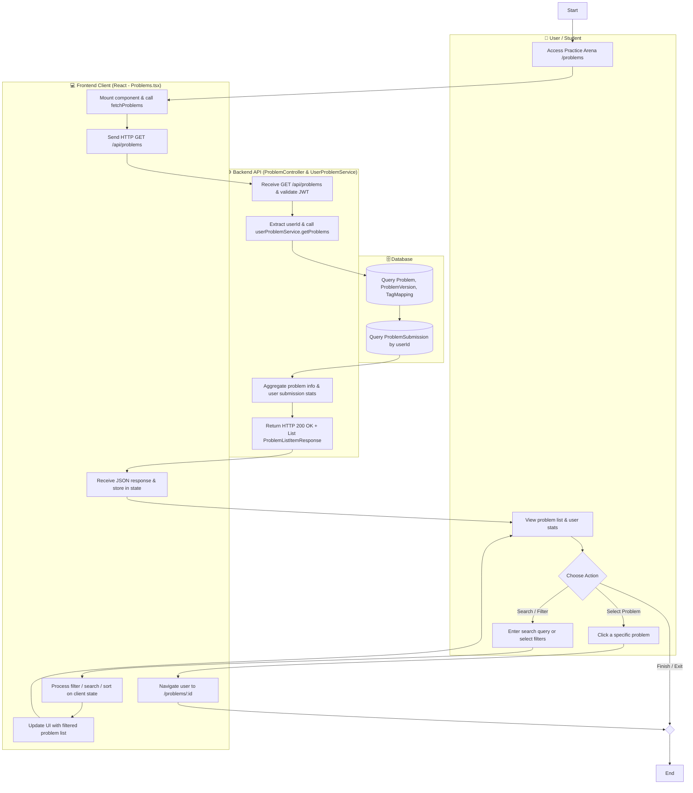
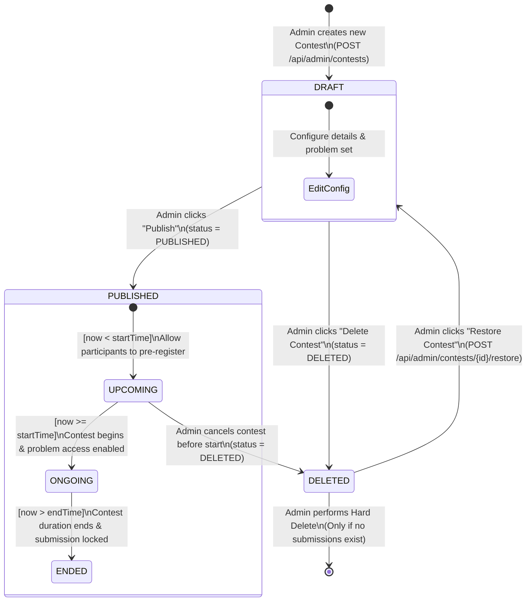

# BUSINESS ANALYSIS & MERMAID DIAGRAMS SPECIFICATION
**Project:** Nonstop Coding Platform (SWP391 Integrated Coding Education & Competitive Programming Platform)  
**Role:** Senior Business Analyst & Senior Fullstack Developer  
**Author / Student:** Duy Phuong (DE190416)  

---

## I. ACADEMIC & DRAW.IO RENDER COMPLIANCE RULES

To prevent Draw.io / Mermaid rendering issues caused by the **"First Occurrence Wins"** rule (where nodes get locked to the wrong subgraph if cross-lane arrows are declared inside subgraphs), all Swimlane Diagrams **MUST** strictly adhere to a 3-Part Architecture:

1. **PART 1: Subgraphs and Internal Nodes (Variable Declarations & Local Flows)**
   - Define subgraphs (Actors / Swimlanes).
   - Declare ONLY node labels and local internal edges within each lane.
   - **CRITICAL:** NO cross-lane arrows (`SubA_Node --> SubB_Node`) inside Part 1.
2. **PART 2: Global Nodes (Start, End & Gateway Merges)**
   - Declare global control nodes (`START[Start]`, `END[End]`, and merge diamond gateways `MERGE_END{ }`).
3. **PART 3: Cross-Lane Connections (System Interactions & API Calls)**
   - All inter-lane relationships and HTTP request/response flows are grouped cleanly at the very bottom of the script.

---

## II. SWIMLANE DIAGRAMS (DRAW.IO SAFE 3-PART STRUCTURE)

### 1. Swimlane Diagram: Browse & Search Problems



---

### 2. Swimlane Diagram: Join Contest

```mermaid
graph TB

    %% ==========================================================
    %% PART 1: SUBGRAPHS AND INTERNAL NODES (LOCAL DECLARATIONS)
    %% ==========================================================

    subgraph User["👤 User / Student"]
        U1[Browse contest list /contests]
        U2[Click 'Enter Arena' / 'Register']
        CHOICE_PRIVATE{Is Contest Private?}
        U3[Enter Contest Password]
        U5[Receive Confirmation Modal + Entry Pass]
        U6[Access Contest Arena /contests/:id]
        U7[Display error toast / alert]

        %% Local User Lane Flows
        U2 --> CHOICE_PRIVATE
        CHOICE_PRIVATE -->|Yes| U3
        U5 --> U6
    end

    subgraph Frontend["💻 Frontend Client (React - Contests.tsx)"]
        F1[Check user authentication status]
        F2[Send POST /contests/{id}/register + Password]
        F3[Receive success response]
        F4[Receive error response]

        %% Local Frontend Lane Flows
    end

    subgraph Backend["⚙️ Backend API (ContestService.registerForContest)"]
        B1{1. Validate Auth?}
        B_ERR1[Return UNAUTHENTICATED error]
        B2{2. Contest ENDED?}
        B_ERR2[Return CONTEST_ALREADY_ENDED error]
        B3{3. Already registered?}
        B4{4. Contest IsPrivate?}
        B5{Check Password Matches?}
        B_ERR3[Return CONTEST_PASSWORD_INVALID error]
        B7[Create new ContestParticipantEntity]
        B8[Save participant record to DB]
        B6[Bypass DB insert - Return OK]

        %% Local Backend Lane Flows
        B1 -->|Unauthenticated| B_ERR1
        B1 -->|Valid User| B2
        B2 -->|Already Ended| B_ERR2
        B2 -->|Not Ended| B3
        B3 -->|Registered| B6
        B3 -->|Not Registered| B4
        B4 -->|Has Password| B5
        B5 -->|Wrong Password| B_ERR3
        B5 -->|Correct Password| B7
        B4 -->|Public| B7
        B7 --> B8
        B8 --> B6
    end

    subgraph Database["🗄️ Database"]
        D1[(Select Contest & Check Exists)]
        D2[(Query ContestParticipant Entity)]
        D3[(Insert into contest_participants)]

        %% Local Database Lane Flows
    end

    %% ==========================================================
    %% PART 2: GLOBAL NODES (START, END, MERGE GATEWAYS)
    %% ==========================================================

    START[Start]
    END[End]
    MERGE_END{ }

    %% ==========================================================
    %% PART 3: CROSS-LANE CONNECTIONS (INTER-LANE FLOWS)
    %% ==========================================================

    %% Start & User to Frontend
    START --> U1
    U1 --> F1
    F1 --> U2

    %% User to Frontend Request
    CHOICE_PRIVATE -->|No| F2
    U3 --> F2

    %% Frontend to Backend Request
    F2 --> B1

    %% Backend to Database Interactions
    B2 --> D1
    B3 --> D2
    B8 --> D3

    %% Backend Response to Frontend
    B6 --> F3
    B_ERR1 --> F4
    B_ERR2 --> F4
    B_ERR3 --> F4

    %% Frontend Response to User
    F3 --> U5
    F4 --> U7

    %% Termination Merges to Single End Node
    U6 --> MERGE_END
    U7 --> MERGE_END
    MERGE_END --> END
```

---

### 3. Swimlane Diagram: Create Contests

```mermaid
graph TB

    %% ==========================================================
    %% PART 1: SUBGRAPHS AND INTERNAL NODES (LOCAL DECLARATIONS)
    %% ==========================================================

    subgraph Admin["👨‍💻 Admin / Instructor"]
        A1[Open Create Contest form in Admin Dashboard]
        A2[Input Title, Description, Rules, Times, Password]
        A3[Click 'Save Contest']
        A4[Select & add problems to Contest]
        A5[Click 'Publish Contest']

        %% Local Admin Lane Flows
        A1 --> A2
        A2 --> A3
    end

    subgraph Frontend["💻 Frontend Client (AdminDashboard.tsx)"]
        F1[Validate client-side input]
        F2[Send POST /api/admin/contests]
        F3[Receive Contest response - DRAFT status]
        F4[Send POST /api/admin/contests/{id}/problems]
        F5[Send POST /api/admin/contests/{id}/publish]
        F6[Display Publish Success notification]

        %% Local Frontend Lane Flows
        F1 --> F2
    end

    subgraph Backend["⚙️ Backend API (ContestService)"]
        B1[Receive AdminContestRequest & check Admin auth]
        B2[BCrypt encode password & compute duration]
        B3[Create ContestEntity status = DRAFT]
        B4[Validate status is DRAFT/UPCOMING]
        B5[Create ContestProblemEntity]
        B6[Validate status == DRAFT]
        B7[Update status = PUBLISHED]

        %% Local Backend Lane Flows
        B1 --> B2
        B2 --> B3
        B4 --> B5
        B6 --> B7
    end

    subgraph Database["🗄️ Database"]
        D1[(Insert into contests - status: DRAFT)]
        D2[(Insert into contest_problems)]
        D3[(Update contests SET status = PUBLISHED)]

        %% Local Database Lane Flows
    end

    %% ==========================================================
    %% PART 2: GLOBAL NODES (START, END, MERGE GATEWAYS)
    %% ==========================================================

    START[Start]
    END[End]
    MERGE_END{ }

    %% ==========================================================
    %% PART 3: CROSS-LANE CONNECTIONS (INTER-LANE FLOWS)
    %% ==========================================================

    %% Start & Admin to Frontend
    START --> A1
    A3 --> F1

    %% Frontend to Backend & DB (Create Contest)
    F2 --> B1
    B3 --> D1
    D1 --> F3
    F3 --> A4

    %% Admin to Frontend, Backend & DB (Add Problems)
    A4 --> F4
    F4 --> B4
    B5 --> D2
    D2 --> A5

    %% Admin to Frontend, Backend & DB (Publish Contest)
    A5 --> F5
    F5 --> B6
    B7 --> D3
    D3 --> F6

    %% Termination Merges to Single End Node
    F6 --> MERGE_END
    MERGE_END --> END
```

---

## III. STATE DIAGRAM: CONTEST STATUS


