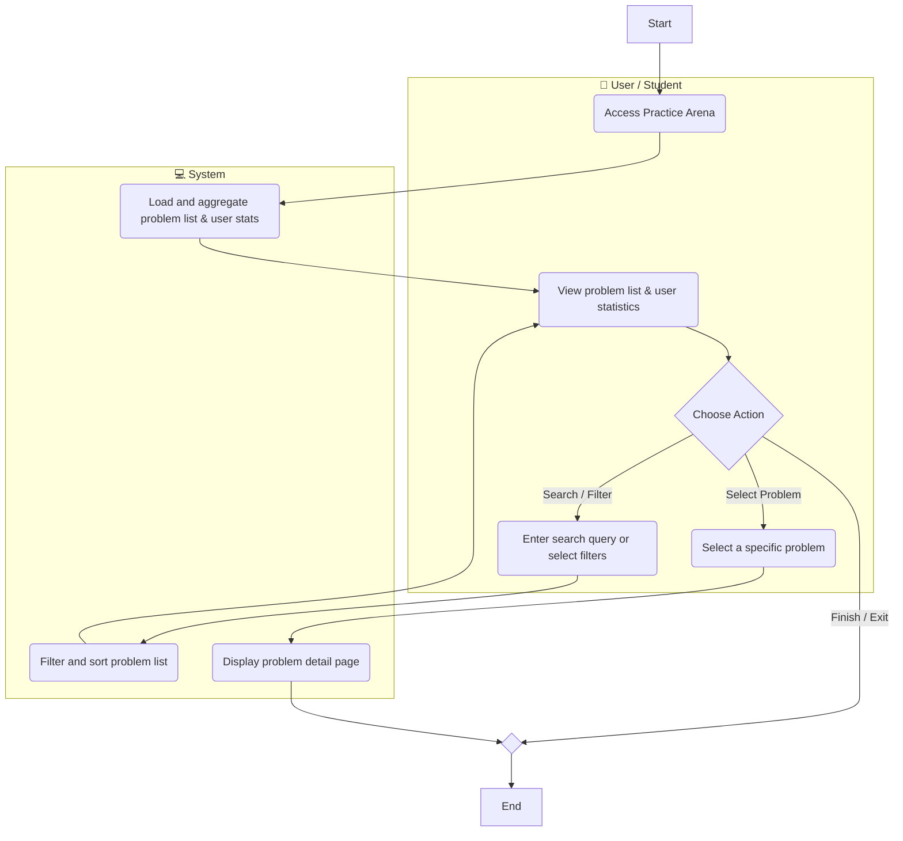
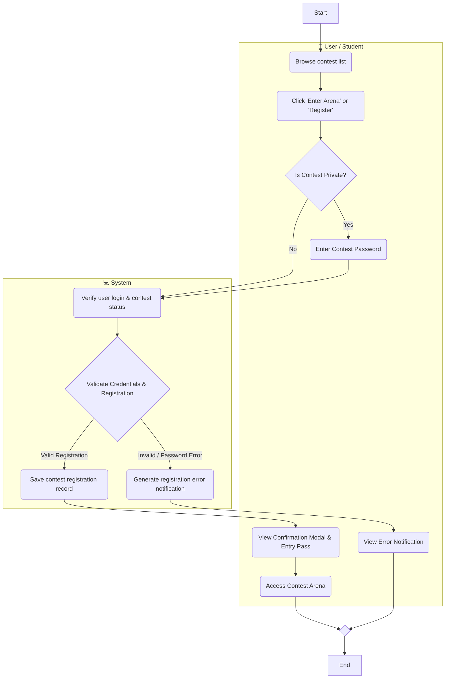
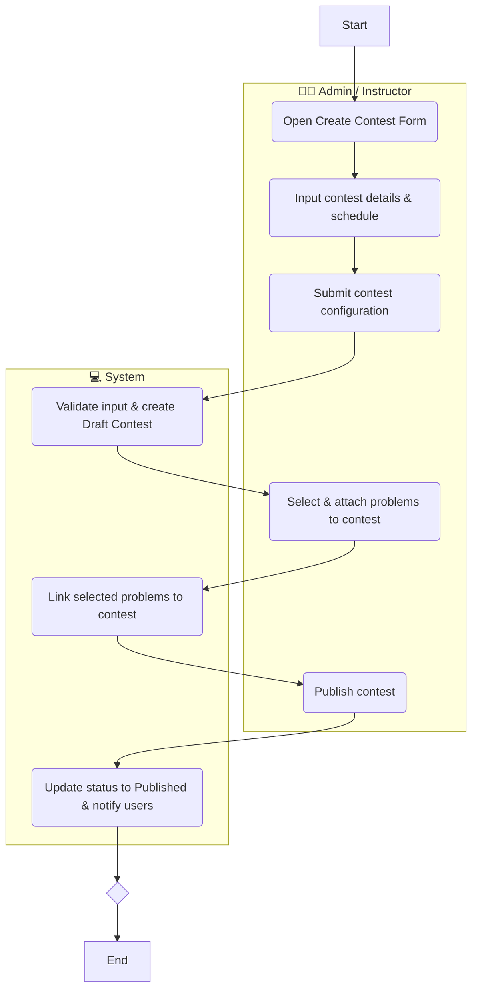
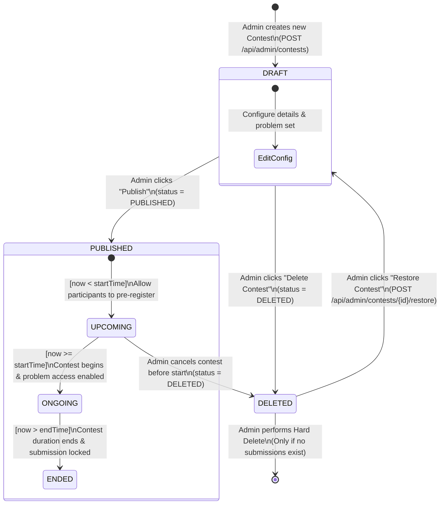

# SIMPLIFIED BUSINESS PROCESS & MERMAID DIAGRAMS (HIGH-LEVEL BA)
**Project:** Nonstop Coding Platform (SWP391 Integrated Coding Education & Competitive Programming Platform)  
**Role:** Senior Business Analyst (BA)  
**Author / Student:** Duy Phuong (DE190416)  

---

## I. BA SPECIFICATION & ARCHITECTURAL RULES

In accordance with High-Level Business Process Modeling (BPMN / UML) guidelines, all Swimlane Diagrams in this document have been updated:
1. **Node Shape Standard:**
   - **Activity / Task Nodes:** Rendered as **Rounded Rectangles** using `node_id(Text)`.
   - **Start & End Nodes:** Rendered as **Square Boxes** `START[Start]` and `END[End]`.
   - **Gateways / Decision Nodes:** Rendered as **Diamonds** `CHOICE{Text}` and `MERGE_END{ }`.
2. **Lane Consolidation (2 Swimlanes):** 
   - **Lane 1 (`Actor`):** `👤 User / Student` (or `👨‍💻 Admin / Instructor`).
   - **Lane 2 (`System`):** `💻 System` (Consolidating Frontend UI, Backend API, and Database into a single system actor).
3. **Mermaid 3-Part Architecture (Draw.io Safe):**
   - **PART 1:** Subgraph definitions & local internal edges only (NO cross-lane arrows inside Part 1).
   - **PART 2:** Global control nodes (`START[Start]`, `END[End]`, `MERGE_END{ }`).
   - **PART 3:** Cross-lane connections at the end of the script.

---

## II. SIMPLIFIED SWIMLANE DIAGRAMS (ROUNDED RECTANGLE ACTIVITIES)

### 1. Swimlane Diagram: Browse & Search Problems

---

### 2. Swimlane Diagram: Join Contest

---

### 3. Swimlane Diagram: Create Contests

---

## III. STATE DIAGRAM: CONTEST STATUS

